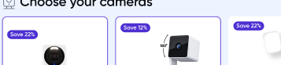
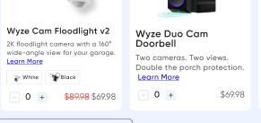
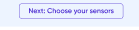
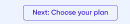
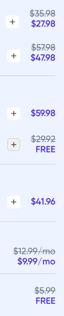
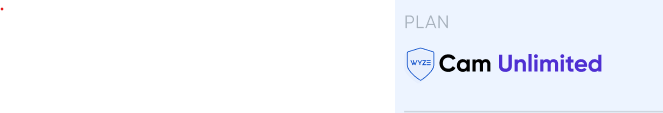
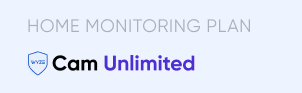
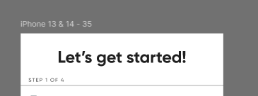

# Wyze Bundle Builder

A client-side **React** prototype of a multi-step **bundle builder** for Wyze
home-security products. Shoppers assemble a system through a 4-step accordion
(cameras → plan → sensors → accessories) while a live **review panel** ("Your
security system") recalculates the total in real time.

> **Process notes.**
> - **AI assistance** was used to help with documentation, keep the code clean, and
>   review the work.
> - **Open design question:** I emailed more than three days ago to confirm which Figma
>   frame was intended as the **mid-screen** layout and which as the **large-screen**
>   layout. Having received no reply, I proceeded with my own interpretation of the
>   breakpoints rather than block on it — see **Responsive layout** and **Design-source
>   notes & assumptions** below.

---

## Requirements

- **Node 20+** (LTS recommended)
- npm

## Run instructions

```bash
npm install
npm run dev        # dev server at http://localhost:5173
npm run build      # type-check (tsc) + production build (vite)
npm run preview    # serve the production build locally
npm test           # unit tests (Vitest) — the pricing function
```

The app runs entirely client-side from a clean clone — no backend or env setup.

### Optional: visual / responsive test harness (Playwright)

```bash
npm run test:e2e          # screenshots every breakpoint, asserts no overflow,
                          # diffs against baselines, and checks persistence + variant behavior
npm run test:e2e:report   # open the HTML report
```

This is **dev-only tooling**, isolated under `e2e/` and fully removable (nothing
in `src/` references it). It auto-starts `npm run dev` (or reuses a running one)
on port 5173. On first run it creates visual baselines
(`e2e/responsive.e2e.ts-snapshots/`) and passes; later runs **fail if the UI
shifts**, with a pixel diff in the report. Full-page screenshots land in
`e2e/screenshots/`. After an intentional UI change, refresh the baselines:

```bash
npx playwright test --update-snapshots
```

---

## Tech stack

| Layer | Choice | Notes |
|---|---|---|
| Bundler | **Vite** | Current standard for client SPAs |
| UI | **React 19 + TypeScript** | |
| Styling | **Tailwind CSS v4** | CSS-first config (`@theme` in `src/styles/tokens.css`); no config file |
| State | **`useReducer` + Context** | single source of truth, no external store |
| Data validation | **Zod** | the catalog JSON is parsed/validated at load |
| Persistence | **`localStorage`** | explicit save, versioned key |
| Fonts | **Self-hosted Gilroy + TT Norms Pro** | the design's real fonts via `@font-face`; Manrope (`@fontsource/manrope`) as fallback |
| Unit tests | **Vitest** | |
| E2E / visual | **Playwright** | responsive, persistence & variant behavior (optional, removable) |

## Project structure

```
.
├─ public/
│  ├─ favicon.svg
│  └─ images/
│     ├─ badges/      satisfaction-badge.png
│     ├─ brand/       Cam Unlimited logo, Fast Shipping, step1–4 (step icons)
│     ├─ icons/       top/bottom arrow (accordion chevrons)
│     ├─ products/    Hub, Motion Sensor, MicroSD, Duo Cam Doorbell
│     └─ swatches/    per-color variant images (Cam v4, Pan v3, Floodlight v2, Battery Cam Pro)
├─ src/
│  ├─ main.tsx              entry point (loads Manrope fallback + index.css)
│  ├─ App.tsx               wraps <BundleBuilder> in <BundleProvider>
│  ├─ index.css             Tailwind import + global styles + focus-visible ring
│  ├─ data/
│  │  ├─ catalog.json       products / steps / shipping (single source of truth)
│  │  └─ catalog.ts         Zod schema → inferred types + validated `catalog` export
│  ├─ state/
│  │  ├─ bundleReducer.ts   reducer + action types
│  │  ├─ BundleContext.tsx  provider (lazy-inits state from localStorage)
│  │  ├─ useBundle.ts       context + hook
│  │  ├─ useLocalStorage.ts save / load helpers (versioned key, try-catch)
│  │  └─ initialState.ts    seed quantities + initial state
│  ├─ lib/
│  │  ├─ pricing.ts         totals in integer cents + variant lookup
│  │  ├─ pricing.test.ts    unit test (187.89 / 238.81 / 50.92)
│  │  └─ money.ts           currency formatting
│  ├─ components/
│  │  ├─ BundleBuilder.tsx  two-column responsive layout
│  │  ├─ accordion/         Step, StepHeader
│  │  ├─ product/           ProductCard, VariantSelector, QuantityStepper, PriceTag, Badge
│  │  └─ review/            ReviewPanel, ReviewGroup, ReviewLine, ShippingRow, GuaranteeBadge,
│  │                        FinancingLine, TotalRow, SavingsCallout, CheckoutButton, SaveLink
│  └─ styles/
│     └─ tokens.css         design tokens (@theme)
├─ e2e/                     Playwright harness — optional, removable
│  ├─ responsive.e2e.ts     screenshots + no-overflow + visual regression, 375→1920
│  ├─ persistence.e2e.ts    save / restore behavior
│  └─ variants.e2e.ts       per-variant quantity behavior
├─ index.html
├─ vite.config.ts           Vite + Tailwind plugin + Vitest config
├─ playwright.config.ts
├─ tsconfig*.json
├─ eslint.config.js  ·  .prettierrc
├─ BUILD_PLAN.md            original build spec
└─ FIGMA_SPEC.md            design tokens / component specs
```

---

## What's implemented

- Two-column layout (builder + review), responsive from ~360px up.
- 4-step accordion; step 1 open on load; exactly one step open at a time; "Next:"
  advances steps 1–3.
- Step headers: "STEP X OF 4", icon, title, "N selected" (distinct products) + chevron.
- Product cards: badge, image, title, description, "Learn More", variant chips,
  quantity stepper, struck + active pricing; selected border when a product's total > 0.
- **Per-variant quantities:** each `productId:variantId` has its own count; the card
  stepper edits the active variant; the review shows every count > 0 as its own line.
- Review panel grouped Cameras / Sensors / Accessories / Plan (empty groups hidden);
  shipping row, satisfaction seal, financing pill, struck total, savings callout,
  Checkout (placeholder), Save link.
- Card ↔ review steppers stay in sync; total & savings recalculate live.
- Data-driven from `catalog.json`; seeded initial state matches the design.
- Save / restore via `localStorage`.

---

## Decisions & tradeoffs

### Pricing model
All money math is in **integer cents** (`Math.round(n * 100)`) to avoid float drift,
rounded back to 2dp only at display. Shipping is **display-only** (not summed).
A unit test asserts the seeded totals: **active $187.89 / compare $238.81 / savings $50.92**.

### Wyze Cam Pan v3 price inconsistency
The mock is internally inconsistent for Pan v3: the card prints `$39.98 → $34.98`,
but the review line at qty 2 (`$57.98 → $47.98`) implies a unit of **`$28.99 → $23.99`**.
Only the review-derived unit makes the headline total reach $187.89, so that value is
stored in `catalog.json` and used everywhere; the `"Save 12%"` badge is a static string.

### Data validation (Zod)
`catalog.ts` defines a Zod schema as the single source of truth: the types are
inferred from it (`z.infer`) and the JSON is `parse()`-d at module load. A malformed
catalog (missing field, wrong type, bad enum) **throws immediately** rather than being
silently accepted — real validation instead of a `as Catalog` cast.

### Persistence (explicit-save, flicker-free)
Changes are **not** auto-saved. "Save my system for later" writes
`quantities + activeVariant + openStep` to `localStorage` under the versioned key
`wyze-bundle-builder:v1`. State is **lazy-initialized** straight from storage on first
render (no seed→saved flash); empty/corrupt storage falls back to the seed.

### Fonts
The design's actual fonts — **Gilroy** + **TT Norms Pro** (commercial, not on npm) — are
**self-hosted** under `public/fonts/` and applied directly via `@font-face` in
`src/styles/tokens.css` (Gilroy Regular/Medium/SemiBold/Bold + a real Gilroy italic, plus
TT Norms Pro for the Checkout button). **Manrope** (`@fontsource/manrope`, weights
400/500/600/700) is kept only as the `--font-sans` fallback. Because a genuine
**Gilroy-RegularItalic** face is bundled, the italic "Save my system for later" link
renders as a real italic — not the browser's synthesized (faux) italic.

### Responsive layout
The two main sections switch between **side-by-side** and **stacked** based on width:
- **≥1440px:** steps left + review right; product cards are **horizontal** (image-left).
- **1024–1439px:** stacked; the review becomes a 2-column panel (items left, totals +
  satisfaction text right); cards are **vertical** (image on top).
- **<1024px:** single column; compact review footer.
- **<768px (phone):** adds the "Let's get started!" heading at the top.

---

## Design-source notes & assumptions

A few aspects of the Figma source were ambiguous or limited and directly shaped some
implementation decisions. Documenting them here for transparency — reference
screenshots live in [`docs/`](docs/).

**1. Discount offers are baked into the product image, not a separate layer.**
The "Save 22%" / "Save 12%" offers appear *inside* the exported product image rather
than as a standalone badge component, so the intended placement/anchor of the badge as
its own UI element wasn't clear from the file. I implemented it as a top-left pill badge
overlaid on the image — a clean, conventional interpretation — driven by data (the
`badge` string in `catalog.json`), so it's trivial to reposition once the design intent
is confirmed.



**2. Some assets couldn't be exported/copied cleanly — a consequence of #1.**
Because the offer badge is fused into the product artwork rather than being a separate
layer, several of those images couldn't be exported or copied cleanly. Where that wasn't
possible I substituted icons, which render at lower quality (slightly blurry) than the
properly-exported assets.

**3. Inconsistent image resolution — same root cause.**
For the same reason (the offer baked into the artwork), several product images come out
low-resolution and look blurry even when downloaded directly — notably the 4th and last
camera (Duo Cam Doorbell, Battery Cam Pro). Higher-resolution source exports would fix this.

**4. The product cards aren't a consistent type system in the design.**
Title/description sizing and spacing differ between cards — especially between products
that have a variant selector and those that don't (e.g. the doorbell) — and there's no
discernible rule behind the variations. Because there was no pattern to reproduce, I
**normalized the cards to one consistent type system** across all products rather than
copying the design's per-card inconsistencies.



**5. Quantity stepper follows the design's position (after the content), not pinned to the card bottom.**
I wanted the +/- stepper to sit at the bottom of every card so the controls line up across
the row whether or not a product has a variant switch — but the design (and the other
screens) places the stepper directly after the text/chips rather than bottom-anchored, so
I stayed faithful to the design and left it inline.

**6. The "Next:" button label is inconsistent between frames.**
The two frames disagree on the step-1 button — one reads "Next: Choose your sensors"
(which skips the plan step), the other "Next: Choose your plan". Since they conflict, I
followed the **canonical step order** instead of the literal label: each "Next:" advances
to the immediately following step (cameras → plan → sensors → extra) and is labelled with
that next step's title — so step 1 reads "Next: Choose your plan".




**7. Review prices aren't aligned consistently in the design.**
A line that has a struck "before" price aligns differently from one with a single price
(which appears centered), so the price column doesn't line up symmetrically down the panel.
I normalized every review price to one consistent alignment (struck above active,
right-aligned) so all lines match.



**8. The plan group's label is inconsistent across screens.**
The review's plan section is labelled "PLAN" in two frames but "HOME MONITORING PLAN" on
the phone frame — unclear whether that's intentional. Since the other category headers are
all short single words (CAMERAS / SENSORS / ACCESSORIES), I unified it to one consistent
label ("PLAN") on every screen rather than reproducing the per-screen rename.




**9. The "Let's get started!" heading exists only in the phone frame.**
This heading appears in the phone design but in none of the desktop frames, so it's
rendered **phone-only** (shown < 768px) and hidden on larger screens.



**10. Padding and spacing aren't consistent in the design — even within the same layout.**
The whitespace between product cards, between accordion steps, and around several other
elements varies from place to place with no discernible rhythm — and the inconsistency
shows up *within a single frame*, not only between breakpoints (the same elements can sit
on different gaps in one layout). With no consistent spacing scale to reproduce, I
**normalized padding and gaps to one consistent system** so cards, steps, and panels read
evenly, rather than copying the source's uneven spacing.

> _More notes to be added._
